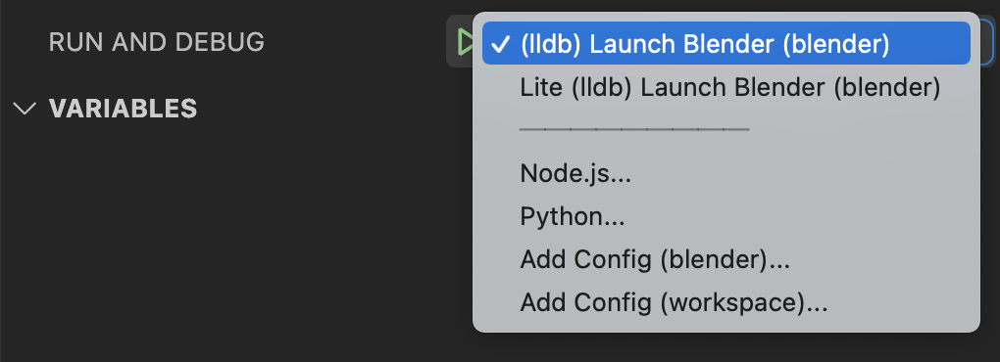

TL;DR In VS Code, you can create launch configuration to easy launch / debug blender. You can view mine [here](https://gist.github.com/rupsis/55f7b182349924de4eb95e68735fca95).

---

## Launch Configurations

This post will go over my blender development setup, and some of the configurations I use.

// Do I need this?
**Note** this is for VS code specifically. If you're working on Windows, you're _probably_ using Visual Studios (not VS code). The launch configurations **options** will still be applicable, but how it's actually configured will be different.

## Part 1, The Task

`task.json` allows you to define _tasks_ (big shock). Tasks are essentially just commands that generally need to be run before launching something. In our case, we need to build (compile) blender before we can actually run it. Here is my `task.json`

```json
{
  "version": "2.0.0",
  "tasks": [
    {
      "label": "Build Blender",
      "type": "shell",
      "command": "make debug developer ccache ninja",
      "group": "build"
    },
    {
      "label": "Lite Build Blender",
      "type": "shell",
      "command": "make CC='ccache gcc' lite",
      "group": "build"
    }
  ]
}
```

as you can see, I have defined 2 different tasks. The first is "Build Blender" and the second is "Lite Build Blender". The difference between the two is the `command` that is run. For the first task I run the `debug` build. This builds blender with extra debugging symbols allowing me to step though the code and debug the flow. The second is a `lite` version of blender. It's a stripped down version (less features), and compiles faster. The different build options can be found [here](https://wiki.blender.org/wiki/Building_Blender/Options).

The 2 different tasks then allow me to create different launch settings.

```json
{
  // Use IntelliSense to learn about possible attributes.
  // Hover to view descriptions of existing attributes.
  // For more information, visit: https://go.microsoft.com/fwlink/?linkid=830387
  "version": "0.2.0",
  "configurations": [
    {
      "name": "(lldb) Launch Blender",
      "type": "lldb",
      "request": "launch",
      "program": "${workspaceFolder}/../build_darwin_debug/bin/Blender.app/Contents/MacOS/Blender",
      "args": [
        "/Users/user_name/projects/blender/dev/blend_file_name.blend",
        "--debug-all"
      ],
      "terminal": "integrated",
      "stopOnEntry": false,
      "cwd": "${workspaceFolder}",
      "preLaunchTask": "Build Blender" // Optional; you can use if you want it to build before launching
    },
    // For building lite version
    {
      "name": "Lite (lldb) Launch Blender",
      "type": "lldb",
      "request": "launch",
      "program": "${workspaceFolder}/../build_darwin_lite/bin/Blender.app/Contents/MacOS/Blender",
      "args": [
        "--debug",
        "--debug-memory",
        // "--debug-python",
        // "--debug-ghost",
        // "--debug-wm",
        // "--debug-depsgraph",
        // "--debug-depsgraph-eval",
        // "--debug-depsgraph-build",
        // "--debug-depsgraph-no-threads",
        // "--debug-depsgraph-pretty",
        "--debug-events"
        // "--debug-handlers"
      ], //  I usually have all of the flags listed, and commented out. That way I can toggle them on as needed.
      "terminal": "integrated",
      "stopOnEntry": false,
      "cwd": "${workspaceFolder}",
      "preLaunchTask": "Lite Build Blender"
    }
  ]
}
```

These two launch settings allow me to compile and launch blender in different ways. Depending what I'm working on, I can easily launch the lite version of blender (it's _really_ stripped down in terms of features), or the debug version, or whatever other version (Release, etc) I want. VS code also provides a drop down menu to easily launch the target version I want.



## Launching (and re-launching) Blender

_By far_ the most useful aspect of these launch configurations is the ability to launch blender with a specific target blend file. When working on a task, say, a bug. There generally is an associated blend file that details the issue. Being able to quickly build (and re-build) blender and launch against the test `.blend` is a huge time saver, and allows for quicker development.

There are plenty more ways to configure building / launching. But for the moment this is what I use.
